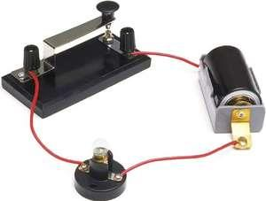
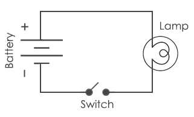

# Análise de Circuitos Elétricos
## Apresentação da Disciplina

Prof. M.Sc. Diego Ascânio Santos (ascanio@cefetmg.br)

Aula baseada sobre o material do professor Dr. Emerson Gonçalves de Melo (emerdemelo@usp.br - DEMAR EEL USP)

Divinópolis, 2023.

---

Apresentação da Disciplina - Roteiro

1. Quem sou eu
2. Quem são vocês
3. Introdução
4. Objetivos
5. Cronograma de Aulas
6. Cronograma de Listas 
7. Cronograma de Atividades Avaliativas
8. Bibliografia

---

<!-- _class: lead -->
# Apresentação da Disciplina

---

Apresentação da Disciplina - Professor

Prof. M.Sc. Diego Ascânio Santos

Contato: ascanio@cefetmg.br

Possui graduação em Engenharia de Computação pelo CEFET-MG (2017), licenciatura EBTT (subárea informática / comunicação) em Programa Especial de Formação de Docentes pelo CEFET-MG (2018) e mestrado em Modelagem Matemática e Computacional pelo CEFET-MG (2022). Atualmente é docente EBTT e foi técnico em tecnologia da informação, ambas experiências nesta instituição. Tem experiência na área de Engenharia da Computação, com ênfase em Redes de Computadores e Modelos Matemáticos Computacionais, atuando principalmente nos seguintes temas: internet das coisas, análise de sentimentos, modelos matemáticos computacionais, sistemas digitais, e jogos eletrônicos.

---

<!-- _class: lead -->

Apresentação da Disciplina - Alunos

# Quem são vocês?

---

Apresentação da Disciplina - Introdução

- Engenheiros
    - O que somos?
    <!-- 
    Profissionais que aplicam ferramentas matemáticas para manipular
    modelos físicos que descrevem fenômenos naturais com o objetivo de prover
    soluções para necessidades práticas.
    -->
- Sistemas Eletroeletrônicos
    <!-- Fazem parte de nosso estilo de vida e são classificados em cinco grandes áreas: -->
    - Potência <!-- geração, transmissão, distribuição de energia-->
    - Comunicação <!-- telefonia, satélites, redes, comunicações ópticas; -->
    - Processamento de Sinais <!-- captação, conformação, reprodução de áudio e imagens; -->
    - Controle <!-- sensoriamento, atuação, lógica; -->
    - Computação <!-- interface, processamento, armazenamento de informação -->

---

Apresentação da Disciplina - Introdução

    

    

    <ul>
        <li class="regular">Circuitos Elétricos: Modelos matemáticos que descrevem de forma aproximada o comportamento de sistemas elétricos;</li>
        <li class="regular">É importante entender estes modelos para que seja possível operá-los, projetá-los e mantê-los de forma segura e eficiente.</li>
    </ul>
    

    

    

        <figure>
            
            <figcaption class="small">Circuito Elétrico composto por bateria, chave e lâmpada.</figcaption>
        </figure>
        <figure>
            
            <figcaption class="small">Representação em diagrama do circuito acima.</figcaption>
        </figure>
    

---

Apresentação da Disciplina - Introdução

<ul>
    <li>Elemento: componente básico de um circuito (fonte, resistor, lâmpada, etc).</li>
    <li>Análise de circuitos: processo de de determinar as propriedades elétricas (tensão, corrente, potência) dos elementos do circuito em função do tempo ou frequência.</li>
    <li>Teoria de circuitos</li>
    <ul>
        <li>Um caso especial da teoria eletromagnética</li>
        

        <ul>
            <li>Trata do estudo de cargas elétricas:</li>
            <ul>
                <li>Estáticas</li>
                <li>Em movimento</li>
            </ul>
        </ul>
        

        <li>Permite encontrar respostas simples para questões que seriam complexas de resolver somente com a teoria eletromagnética.</li>
    </ul>
</ul>

---

Apresentação da Disciplina - Objetivos

Desenvolver habilidades para aplicar as diversas técnicas para análise de circuitos elétricos, identificar, formular e resolver problemas, buscando:

<ul>
    <li>Compreender as leis fundamentais para análise de circuitos;</li>
    <li>Estudar e aplicar técnicas para a resolução de circuitos CC e CA;</li>
    <li>Analisar a resposta de circuitos de primeira e segunda ordem;</li>
    <li>Estudar os conceitos para a determinação da potência em circuitos CA;</li>
    <li>Estudar Quadripolos e suas aplicações.</li>
</ul>

---

Apresentação da Disciplina - Cronograma de Aulas

| Data       | Aula | Assunto                                                                                                   |
|:----------:|:----:|-----------------------------------------------------------------------------------------------------------|
| 07/08/2023 | 1    | Elementos de Circuitos; Lei de Ohm; Potência Elétrica.                                                    |
| 08/08/2023 | 2    | Divisores de Tensão e Corrente; Resistência Série e Paralela;                                             |
| 14/08/2023 | 3    | Conversões Y-Delta; Leis de Kirchhoff; Análise Nodal; Análise de Malhas.                                  |
| 15/08/2023 | 4    | Conversões Y-Delta; Leis de Kirchhoff; Análise Nodal; Análise de Malhas.                                  |
| 21/08/2023 | 5    | Linearidade e Superposição; Transformação de Fontes; Thévenin e Norton; Máxima Transferência de Potência. |
| 22/08/2023 | 6    | Linearidade e Superposição; Transformação de Fontes; Thévenin e Norton; Máxima Transferência de Potência. |
| 28/08/2023 | 7    | Revisão para Atividade Avaliativa 1                                                                       |
| 29/08/2023 | 8    | Atividade Avaliativa 1                                                                                    |

---

Apresentação da Disciplina - Cronograma de Aulas

| Data       | Aula | Assunto                                                                                                   |
|:----------:|:----:|-----------------------------------------------------------------------------------------------------------|
| 04/09/2023 | 9    | Capacitância e Indutância (Comportamento de Capacitores)                                                  |
| 05/09/2023 | 10   | Capacitância e Indutância (Comportamento de Indutores)                                                    |
| 11/09/2023 | 11   | Circuitos de Primeira Ordem (Resposta ao Impulso e ao Degrau Unitário RL e RC); Equações de resposta;     |
| 12/09/2023 | 12   | Circuitos de Primeira Ordem (Resposta ao Impulso e ao Degrau Unitário RL e RC); Equações de resposta;     |
| 18/09/2023 | 13   | Circuitos de Segunda Ordem (Resposta ao Impulso e ao Degrau Unitário RLC); Equações de resposta;          |
| 19/09/2023 | 14   | Circuitos de Segunda Ordem (Resposta ao Impulso e ao Degrau Unitário RLC); Equações de resposta;          |
| 25/09/2023 | XX   | SBBD 2023                                                                                                 |
| 26/09/2023 | XX   | SBBD 2023                                                                                                 |

---

Apresentação da Disciplina - Cronograma de Aulas

| Data       | Aula | Assunto                                                                                                   |
|:----------:|:----:|-----------------------------------------------------------------------------------------------------------|
| 02/10/2023 | 15   | Revisão Atividade Avaliativa 2.                                                                           |
| 03/10/2023 | 16   | Atividade Avaliativa 2.                                                                                   |
| 09/10/2023 | XX   | Recesso 12 de Outubro.                                                                                    |
| 10/10/2023 | XX   | Recesso 12 de Outubro.                                                                                    |
| 16/10/2023 | 17   | Senoides e Fasores; Impedância e Admitância.                                                              |
| 17/10/2023 | 18   | Senoides e Fasores; Impedância e Admitância.                                                              |
| 23/10/2023 |  19  | Leis de Kirchhoff no Domínio da Frequência: Análise Nodal e de Malhas.                                    |
| 24/10/2023 |  20  | Leis de Kirchhoff no Domínio da Frequência: Análise Nodal e de Malhas.                                    |

---

Apresentação da Disciplina - Cronograma de Aulas

| Data       | Aula | Assunto                                                                                                   |
|:----------:|:----:|-----------------------------------------------------------------------------------------------------------|
| 30/10/2023 |  21  | Ressonância e Filtros                                                                                     |
| 31/10/2023 |  22  | Ressonância e Filtros                                                                                     |
| 06/11/2023 |  23  | Análise de Potência em CA: Instantânea e Média; Valores Eficazes de Tensão e Corrente; Potência Aparente e Fator de Potência; Potência Complexa. |
| 07/11/2023 |  24  | Análise de Potência em CA: Instantânea e Média; Valores Eficazes de Tensão e Corrente; Potência Aparente e Fator de Potência; Potência Complexa. |
| 13/11/2023 |  25  | Quadripolos: Indutância Mútua; Transformador Linear; Transformador Ideal, Retificadores, Amplificdores Operacionais |
| 14/11/2023 |  26  | Quadripolos: Indutância Mútua; Transformador Linear; Transformador Ideal, Retificadores, Amplificdores Operacionais |
| 20/11/2023 |  27  | Quadripolos: Indutância Mútua; Transformador Linear; Transformador Ideal, Retificadores, Amplificdores Operacionais |
| 21/11/2023 |  28  | Revisão para Atividade Avaliativa 3                                                                       |
| 27/11/2023 |  29  | Atividade Avaliativa 3                                                                                    |
| 28/11/2023 |  30  | Atividade Avaliativa Substitutiva                                                                         |
| 05/12/2023 |  31  | Exame Especial                                                                                            |

---

Apresentação da Disciplina - Cronograma de Listas 

Valor de cada lista: \( 25 \over 11 \) pontos 

| Lista | Assunto                                                                                 | Entrega      |
|:-----:|-----------------------------------------------------------------------------------------|:------------:|
|   1   | Conceitos Básicos                                                                       | 15/08/2023   |
|   2   | Circuitos Resistivos                                                                    | 15/08/2023   |
|   3   | Técnicas de Análise de circuitos (Y-Delta, Kirchhoff, Análise Nodal, Análise de Malhas) | 22/08/2023   |
|   4   | Técnicas de Análise de circuitos (Linearidade e Superposição, Transformação de Fontes, Thévenin e Norton, Máxima Transferência de Potência) | 29/08/2023   |
|   5   | Capacitância e Indutância                                                               | 12/09/2023   |
|   6   | Circuitos de Primeira Ordem                                                             | 19/09/2023   |

---

Apresentação da Disciplina - Cronograma de Listas 

Valor de cada lista: \( 25 \over 11 \) pontos 

| Lista | Assunto                                                                                 | Entrega      |
|:-----:|-----------------------------------------------------------------------------------------|:------------:|
|   7   | Circuitos de Segunda Ordem                                                              | 26/09/2023   |
|   8   | Análise Senoidal                                                                        | 31/10/2023   |
|   9   | Filtros                                                                                 | 07/11/2023   |
|  10   | Análise de Potência                                                                     | 14/11/2023   |
|  11   | Quadripolos                                                                             | 27/11/2023   |

---

Apresentação da Disciplina - Cronograma de Atividades Avaliativas

Valor de cada Atividade Avaliativa: 25 pontos.

Valor do exame especial: 100 pontos.

Nota Final: \( {\text{NS} + \text{NEE}} \over {2} \), onde, NS: nota do semestre, NEE: nota do exame especial.

| Atividade Avaliativa | Assunto                                                                                                 | Data       |
|:--------------------:|---------------------------------------------------------------------------------------------------------|:----------:|
|          1           | Conceitos Básicos, Circuitos Resistivos, Técnicas de Análise de Circuitos. (Até aula 6)                 | 29/08/2023 |
|          2           | Capacitância e Indutância, Circuitos de Primeira Ordem, Circuitos de Segunda Ordem (Aula 9 até aula 14) | 03/10/2023 |
|          3           | Análise Senoidal, Filtros, Análise da Potência e Quadripolos (Aula 17 até aula 27)                      | 27/11/2023 |
|     Substitutiva     | Toda a matéria.                                                                                         | 27/11/2023 |
|    Exame Especial    | Toda a matéria.                                                                                         | 05/12/2023 |

---

Apresentação da Disciplina

# Bibliografia

1. NILSSON, J.W.; RIEDEL, S.A. Circuitos Elétricos. 8ª Edição. Editora: Pearson, 2009.
2. BOYLESTAD, R. L. Introdução à Análise de Circuitos. 12ª Edição. Editora: Pearson, 2012.
3. MARIOTTO, Paulo A. Análise de circuitos. 1ª edição. Editora: Pearson, 2002.

